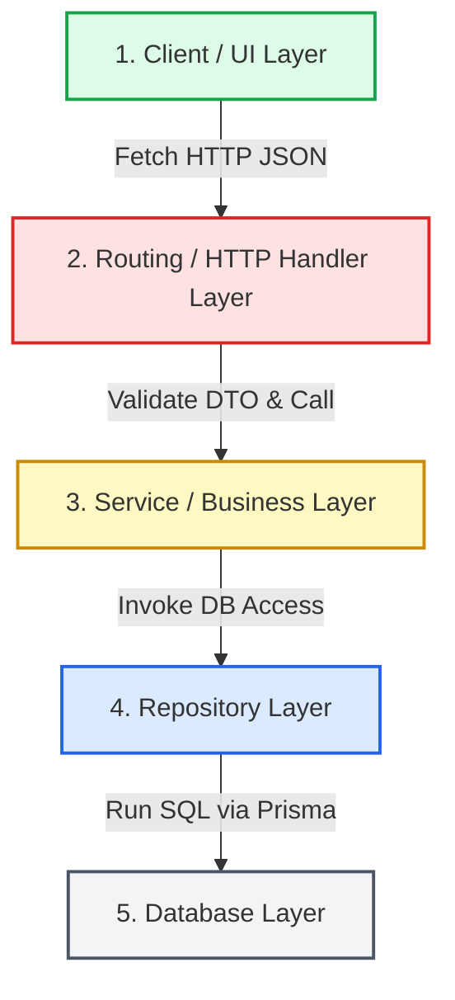

# ZooSite Clean Architecture Error Registry

> **Last Updated**: May 27, 2026
> **Purpose**: This central registry catalogs, organizes, and links to common system errors, compatibility issues, and runtime failures. The tracking is divided into isolated files for each **Clean Architecture Layer** to ensure highly traceable debugging boundaries.

---

## 🏗️ Architectural Layer Overview & Trace Paths

Below is the dependency direction and request trace path for the application. Errors should be traced downwards (request flow) or upwards (response flow):

---

## 📂 Layer Registry Indexes

Select a specific architectural layer directory to view dedicated logs, symptoms, exact trace paths, and resolution steps:

| Layer Number | Layer Name | Directory File Reference | Focus Area |
| :---: | :--- | :--- | :--- |
| **1** | **Client / UI Layer** | 🟢 [client_layer.md](file:///d:/CHAKKSSS/ZooSite/docs/errors/client_layer.md) | Browser UI, Client Fetches, Session Providers |
| **2** | **Routing & HTTP Handlers** | 🔴 [routing_layer.md](file:///d:/CHAKKSSS/ZooSite/docs/errors/routing_layer.md) | API Routes, NextAuth wrappers, Middleware routing |
| **3** | **Service / Business Layer** | 🟡 [service_layer.md](file:///d:/CHAKKSSS/ZooSite/docs/errors/service_layer.md) | Domain Logic, Zod Validation Schemas, Media/API Integrations |
| **4** | **Repository Layer** | 🔵 [repository_layer.md](file:///d:/CHAKKSSS/ZooSite/docs/errors/repository_layer.md) | Database Access, Prisma Client queries, Transactions |
| **5** | **Database Layer** | ⚪ [database_layer.md](file:///d:/CHAKKSSS/ZooSite/docs/errors/database_layer.md) | PostgreSQL Engine, local port `5432` bindings, migrations |
